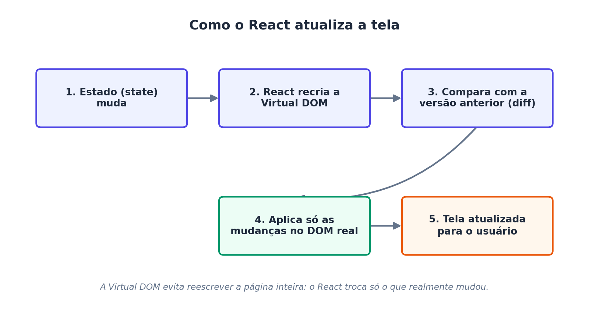
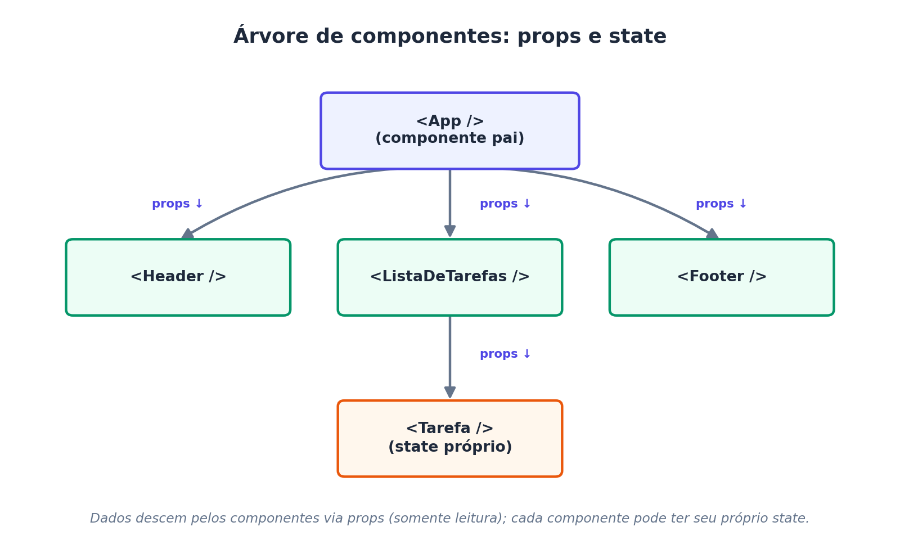
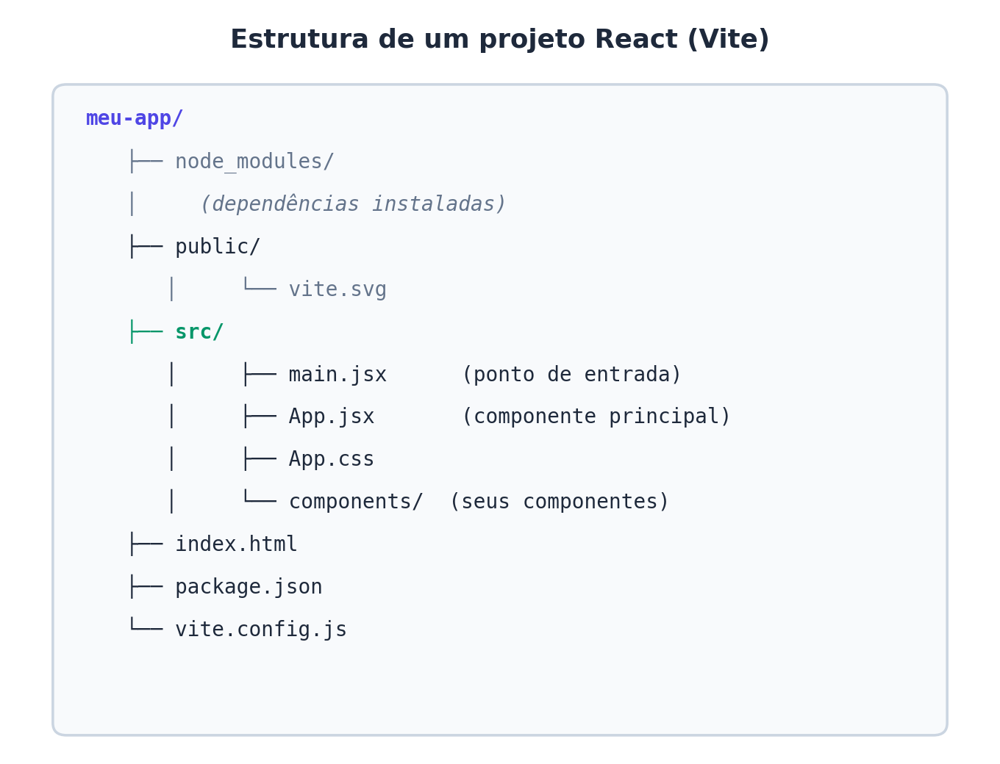

# React - Quick start {#introducao-react}

**Referências:**

- W3Schools React Tutorial — [Introduction](https://www.w3schools.com/react/react_intro.asp), [Get Started](https://www.w3schools.com/react/react_getstarted.asp), [Start a New React App](https://www.w3schools.com/react/react_first_app.asp)
- Documentação oficial — [react.dev/learn](https://react.dev/learn)

---

## Objetivos {-}

Ao final desta leitura, você deve ser capaz de:

1. Explicar o que é o React e por que ele é usado no desenvolvimento web moderno.
2. Entender os conceitos de **componente**, **JSX**, **props** e **state**.
3. Criar um projeto React do zero usando o Vite e entender o papel de cada arquivo gerado.
4. Executar, parar e reiniciar o servidor de desenvolvimento com segurança.
5. Construir e renderizar um primeiro componente funcional.

---

## O que é o React?

React é uma **biblioteca JavaScript** de código aberto, mantida pela Meta, usada para construir **interfaces de usuário (UI)**, especialmente para aplicações de página única (*Single Page Applications* — SPA).

Diferente de um framework completo, o React cuida apenas da **camada de visualização** (a "V" do padrão MVC). Ele se integra facilmente com outras bibliotecas (roteamento, gerenciamento de estado global, requisições HTTP), o que o torna flexível para diferentes arquiteturas de projeto.

### Por que o React é tão usado?

Table: (#tab:tabela-motivos-react) Motivos para a popularidade do React

| Motivo | Explicação |
|---|---|
| **Componentização** | A interface é dividida em pequenas peças reutilizáveis (componentes), o que organiza e facilita a manutenção do código. |
| **Virtual DOM** | O React mantém uma representação em memória da interface e atualiza o DOM real de forma otimizada, só onde houve mudança. |
| **Declarativo** | Descrevemos *como a interface deve parecer* para cada estado da aplicação, e o React se encarrega de atualizar a tela. |
| **Ecossistema maduro** | Grande comunidade, muitas bibliotecas complementares (React Router, Redux, Zustand, etc.) e forte demanda no mercado de trabalho. |
| **Reutilização entre plataformas** | Conceitos e boa parte do código podem ser aproveitados em React Native para aplicativos mobile. |

Ver Tabela \@ref(tab:tabela-motivos-react).

### Como o React atualiza a tela (Virtual DOM)

Manipular o DOM real do navegador diretamente é uma operação custosa. O React resolve isso mantendo uma cópia leve da interface em memória (a *Virtual DOM*) e comparando versões antes de tocar o DOM real, conforme ilustrado na Figura \@ref(fig:figura-virtual-dom).

(#fig:figura-virtual-dom)

---

## JSX: misturando HTML e JavaScript

**JSX** (*JavaScript XML*) é uma extensão de sintaxe que permite escrever elementos parecidos com HTML dentro do código JavaScript. O navegador não entende JSX diretamente — ferramentas de build (o Vite, usando o compilador **esbuild**/**Babel**) convertem o JSX em chamadas `React.createElement()` antes da execução.

```jsx
const elemento = <h1>Olá, turma de Full Stack!</h1>;
```

Isso é equivalente, "por baixo dos panos", a:

```js
const elemento = React.createElement('h1', null, 'Olá, turma de Full Stack!');
```

### Regras importantes do JSX

- Todo componente deve retornar **um único elemento raiz** (ou usar um *Fragment* `<>...</>`).
- Atributos HTML usam **camelCase**: `class` vira `className`, `onclick` vira `onClick`.
- Expressões JavaScript são inseridas entre chaves `{ }`:

```jsx
const nome = "Juliana";
const saudacao = <p>Bem-vinda, {nome}!</p>;
```

- Tags devem ser sempre fechadas, inclusive as que não têm par no HTML: ``, `<br />`.

---

## Componentes

Um **componente** é uma função (ou, historicamente, uma classe) que retorna JSX descrevendo um pedaço da interface. É a unidade fundamental de reutilização no React.

```jsx
function BemVindo() {
  return <h2>Bem-vindo(a) à disciplina de Programação Web Full Stack!</h2>;
}

export default BemVindo;
```

Componentes podem ser combinados como peças de Lego, formando uma **árvore de componentes**: um componente pai renderiza outros componentes filhos, passando dados para eles.

### Props e State

- **Props** (*properties*): dados enviados de um componente pai para um componente filho. São **somente leitura** — o filho não pode alterá-las diretamente.
- **State**: dados internos e mutáveis de um componente, controlados pelo próprio componente (por meio do hook `useState`). Quando o state muda, o React re-renderiza o componente automaticamente.

```jsx
import { useState } from 'react';

function Contador() {
  const [contagem, setContagem] = useState(0);

  return (
    <div>
      <p>Você clicou {contagem} vezes</p>
      <button onClick={() => setContagem(contagem + 1)}>
        Clique aqui
      </button>
    </div>
  );
}
```

A Figura \@ref(fig:figura-componentes-props-state) mostra como as props descem pela árvore de componentes e como o state pode ser local a um componente.

(#fig:figura-componentes-props-state)

---

## Criando o primeiro projeto React

A forma recomendada atualmente pela documentação oficial (react.dev) é usar uma ferramenta de build moderna, como o **Vite**, em vez do antigo `create-react-app` (hoje descontinuado).

### Pré-requisitos

- **Node.js** instalado (versão LTS recomendada) — inclui o `npm`.
- Um editor de código (recomendado: VS Code).

### Passo a passo

```bash
# 1. Criar o projeto
npm create vite@latest meu-app -- --template react

# 2. Entrar na pasta do projeto
cd meu-app

# 3. Instalar as dependências
npm install

# 4. Rodar o servidor de desenvolvimento
npm run dev
```

Após o último comando, o terminal exibirá um endereço local (geralmente `http://localhost:5173`). Basta abri-lo no navegador para ver a aplicação React rodando.

### Estrutura de pastas gerada

A Figura \@ref(fig:figura-estrutura-projeto) mostra a estrutura de pastas criada automaticamente pelo Vite ao gerar um projeto React.

(#fig:figura-estrutura-projeto)

Os arquivos mais importantes para o dia a dia de desenvolvimento são:

- **`src/main.jsx`**: ponto de entrada da aplicação; "monta" o componente `App` dentro do `index.html`.
- **`src/App.jsx`**: componente principal, geralmente o ponto de partida da interface.
- **`src/components/`**: pasta (a ser criada pelo próprio desenvolvedor) para organizar os demais componentes.

As próximas quatro subseções respondem, em mais detalhe, perguntas comuns de quem está vendo o React (e o Vite) pela primeira vez.

### O que é o Vite e como ele funciona? {#o-que-e-vite}

**Vite** (pronuncia-se "vit", do francês para "rápido") é uma ferramenta de build e um servidor de desenvolvimento para projetos front-end. Ele não é exclusivo do React — também funciona com Vue, Svelte, JavaScript puro, etc. — mas é a opção recomendada pela documentação oficial do React para começar um novo projeto.

O Vite resolve um problema antigo das ferramentas de build (como o Webpack, usado pelo antigo `create-react-app`): antes de o servidor de desenvolvimento ficar pronto, essas ferramentas precisavam "empacotar" (*bundle*) toda a aplicação de uma vez, o que ficava cada vez mais lento à medida que o projeto crescia.

O Vite funciona em duas etapas bem distintas:

1. **Durante o desenvolvimento (`npm run dev`):** o Vite **não** empacota a aplicação inteira. Ele sobe um servidor local que serve os arquivos usando **módulos ES nativos do navegador** (`import`/`export`), transformando cada arquivo **sob demanda**, só quando o navegador o solicita. Isso torna a inicialização do servidor quase instantânea, mesmo em projetos grandes. Dependências de terceiros (como o próprio `react` e `react-dom`) são pré-otimizadas uma única vez com uma ferramenta chamada **esbuild**, escrita em Go e muito mais rápida que ferramentas baseadas em JavaScript.
2. **Durante a build de produção (`npm run build`):** para gerar os arquivos finais que serão publicados em um servidor, o Vite usa o **Rollup** por baixo dos panos para empacotar, minificar e otimizar todo o código em poucos arquivos estáticos (HTML, CSS e JavaScript), prontos para produção.

Além disso, o Vite oferece **Hot Module Replacement (HMR)**: quando você salva uma alteração em um componente, apenas aquele módulo é atualizado no navegador — sem recarregar a página inteira e, na maioria dos casos, sem perder o state atual da aplicação (por exemplo, o valor de um contador continua o mesmo após a atualização).

> **Para pensar:** pense no Vite como o "motor" que (a) serve os arquivos do projeto durante o desenvolvimento, atualizando a tela quase instantaneamente a cada `Ctrl+S`, e (b) empacota tudo de forma otimizada quando o projeto está pronto para ir ao ar.

### Onde é definido o arquivo de início do projeto? {#arquivo-de-entrada}

Uma dúvida comum é: *"quando eu rodo `npm run dev`, qual arquivo é executado primeiro?"* A resposta envolve três arquivos que trabalham em conjunto:

1. **`index.html` (raiz do projeto)** — é o **ponto de entrada real** de qualquer aplicação Vite, e não um arquivo JavaScript. O Vite trata o `index.html` como o arquivo inicial e procura, dentro dele, uma tag `<script type="module">` apontando para o JavaScript da aplicação:

```html
<!doctype html>
<html lang="pt-br">
  <head>
    <meta charset="UTF-8" />
    <title>Meu App React</title>
  </head>
  <body>
    <div id="root"></div>
    <script type="module" src="/src/main.jsx"></script>
  </body>
</html>
```

2. **`src/main.jsx`** — é o arquivo referenciado pelo `<script>` acima. É o **padrão** definido automaticamente pelo template `react` do Vite, e é ele quem efetivamente "liga" o React à página, procurando o elemento `<div id="root">` do `index.html` e renderizando o componente `App` dentro dele:

```jsx
import { StrictMode } from 'react';
import { createRoot } from 'react-dom/client';
import App from './App.jsx';
import './index.css';

createRoot(document.getElementById('root')).render(
  <StrictMode>
    <App />
  </StrictMode>,
);
```

3. **`src/App.jsx`** — é o componente importado por `main.jsx`. Na prática, é onde a maior parte do código da aula é escrita.

**Ou seja:** `index.html` → carrega `main.jsx` → que renderiza `App.jsx` → que pode importar quantos outros componentes forem necessários.

#### Como alterar o arquivo de entrada?

O padrão (`src/main.jsx` sendo carregado por `index.html`) pode ser alterado de duas formas, caso o projeto precise de outra organização:

- **Trocando o `src` do `<script>` no `index.html`.** Por exemplo, para renomear o ponto de entrada para `src/app.jsx` (ou outro caminho), basta editar a linha `<script type="module" src="/src/main.jsx"></script>` para o novo caminho desejado.
- **Configurando o arquivo `vite.config.js`**, usado para casos mais avançados (por exemplo, projetos com múltiplas páginas HTML de entrada), por meio da opção `build.rollupOptions.input`. Para a maioria dos projetos didáticos, **não é necessário mexer aqui** — o padrão gerado automaticamente já é o recomendado.

> **Para testar:** renomeie `src/main.jsx` para `src/index.jsx`, atualize o `src` no `index.html` para `/src/index.jsx` e rode `npm run dev` novamente. A aplicação deve continuar funcionando normalmente — isso ajuda a fixar que o nome do arquivo em si não é "mágico", é apenas o caminho referenciado no `index.html` que importa.

### Conteúdo dos arquivos gerados automaticamente

Quando o comando `npm create vite@latest` termina, vários arquivos e pastas já vêm prontos. A Tabela \@ref(tab:tabela-arquivos-gerados) resume a função de cada um.

Table: (\#tab:tabela-arquivos-gerados) Arquivos e pastas gerados automaticamente por um projeto Vite + React

| Arquivo / pasta | O que contém | Deve ser editado na aula? |
|---|---|---|
| `index.html` | HTML mínimo da aplicação; contém a `<div id="root">` onde o React será "encaixado" e o `<script>` que carrega `main.jsx`. | Raramente (apenas título da página, favicon, meta tags). |
| `src/main.jsx` | Ponto de entrada em JavaScript; importa `React`, `ReactDOM` e o componente `App`, e manda renderizá-lo dentro da `<div id="root">`. | Raramente. |
| `src/App.jsx` | Componente principal da aplicação; é o "coração" do projeto e o arquivo mais editado durante a aula. | **Sim, o tempo todo.** |
| `src/App.css` | Estilos CSS específicos do componente `App`. | Sim, ao estilizar a interface. |
| `src/index.css` | Estilos CSS globais, aplicados à aplicação inteira (reset de margens, fontes padrão, etc.). | Ocasionalmente. |
| `src/assets/` | Pasta para imagens e outros arquivos estáticos importados diretamente no código JavaScript/JSX. | Sim, ao adicionar imagens. |
| `public/` | Arquivos estáticos servidos "como estão", sem passar pelo processo de build (ex.: `favicon`). Diferente de `src/assets`, nada aqui é processado pelo Vite. | Ocasionalmente. |
| `package.json` | "Ficha técnica" do projeto: nome, versão, lista de dependências (`react`, `react-dom`, `vite`, etc.) e os **scripts** disponíveis (`dev`, `build`, `preview`, `lint`). | Sim, ao instalar novas bibliotecas. |
| `package-lock.json` | Registra as versões **exatas** de cada dependência instalada, garantindo que todos os integrantes da equipe usem as mesmas versões. | **Nunca editar manualmente.** |
| `vite.config.js` | Arquivo de configuração do Vite (plugins, alias de caminhos, opções de build). O template React já vem com o plugin `@vitejs/plugin-react` configurado. | Raramente, em projetos introdutórios. |
| `node_modules/` | Todas as dependências baixadas pelo `npm install`. Pasta pesada e gerada automaticamente — nunca deve ser editada nem enviada ao controle de versão (Git). | **Nunca.** |
| `.gitignore` | Lista de arquivos/pastas que o Git deve ignorar (por exemplo, `node_modules/` e arquivos de build). | Ocasionalmente, para adicionar novas exceções. |

O arquivo `package.json` merece atenção especial, pois é nele que os **scripts** executados pelo `npm` são definidos:

```json
{
  "scripts": {
    "dev": "vite",
    "build": "vite build",
    "lint": "eslint .",
    "preview": "vite preview"
  }
}
```

Quando digitamos `npm run dev` no terminal, o `npm` simplesmente procura a chave `"dev"` dentro de `"scripts"` e executa o comando associado a ela (`vite`, que sobe o servidor de desenvolvimento). É por isso que **o nome do comando (`dev`) é uma convenção do template**, e não uma palavra reservada do npm — o `package.json` poderia, em tese, renomeá-lo para outra coisa, mas a comunidade React/Vite mantém `dev`, `build` e `preview` como padrão em praticamente todos os projetos.

### Executando, parando e reiniciando o projeto

Uma dúvida frequente em aula é: *"depois de fechar o terminal ou o VS Code, como eu volto a rodar o projeto? `npm run dev` é sempre a opção certa?"*

A Tabela \@ref(tab:tabela-scripts-npm) resume os comandos disponíveis por padrão e quando usar cada um.

Table: (\#tab:tabela-scripts-npm) Scripts padrão do npm em um projeto Vite + React

| Comando | O que faz | Quando usar |
|---|---|---|
| `npm run dev` | Sobe o **servidor de desenvolvimento** do Vite, com Hot Module Replacement (HMR) e recarregamento automático a cada alteração salva. | **Sim — é a opção correta durante o desenvolvimento e para as aulas/atividades práticas.** É o comando que você vai usar quase o tempo todo. |
| `npm run build` | Gera a versão **otimizada para produção** (arquivos minificados) na pasta `dist/`. | Apenas quando o projeto estiver pronto para ser publicado/hospedado. |
| `npm run preview` | Sobe um servidor local simples servindo os arquivos já otimizados da pasta `dist/`, para conferir como a aplicação ficará em produção. | Para testar a build de produção antes de publicar. |

#### Como parar o servidor

Com o terminal focado na janela onde `npm run dev` está rodando, basta pressionar:

```text
Ctrl + C
```

Isso encerra o processo do Vite e libera a porta (geralmente `5173`) que estava em uso. O prompt do terminal volta a ficar disponível para novos comandos.

#### Como rodar novamente

Depois de parar o servidor (ou de reabrir o projeto em outro dia), **não é necessário repetir `npm install` nem recriar o projeto** — essa etapa só é preciso refazer se a pasta `node_modules/` tiver sido apagada ou se o projeto for aberto em um computador novo. O fluxo normal é:

```bash
# 1. Entrar na pasta do projeto (se ainda não estiver nela)
cd meu-app

# 2. (Só é necessário se node_modules/ não existir ou estiver desatualizado)
npm install

# 3. Rodar o servidor de desenvolvimento novamente
npm run dev
```

Ou seja: **sim, `npm run dev` é a melhor opção** para parar e retomar o trabalho durante o desenvolvimento — é rápido (o Vite não precisa reconstruir a aplicação inteira) e já vem com o HMR ativado, que é o que torna produtivo editar componentes e ver o resultado quase instantaneamente no navegador.

> **Atenção:** se o terminal for fechado sem usar `Ctrl + C` (por exemplo, fechando a janela diretamente), o processo do Vite pode continuar rodando "preso" na porta `5173`. Nesse caso, ao rodar `npm run dev` novamente, o Vite normalmente detecta a porta ocupada e sobe automaticamente em outra porta livre (ex.: `5174`), avisando isso no terminal.

#### Como testar se está tudo funcionando

1. Rode `npm run dev` no terminal, dentro da pasta do projeto.
2. Copie o endereço mostrado no terminal (algo como `➜ Local: http://localhost:5173/`) e abra-o no navegador.
3. A página deve exibir o conteúdo atual de `src/App.jsx`.
4. Com o servidor ainda rodando, edite um texto em `src/App.jsx`, salve o arquivo (`Ctrl + S`) e observe a página no navegador: ela deve atualizar sozinha, sem precisar apertar F5 — esse é o efeito do Hot Module Replacement descrito na Seção \@ref(o-que-e-vite).
5. Se a página não abrir, confira no terminal se não houve nenhuma mensagem de erro (em vermelho) — geralmente indica um problema de sintaxe no JSX.

---

## Primeiro componente na prática

Edite o arquivo `src/App.jsx` com o conteúdo abaixo:

```jsx
import { useState } from 'react';
import './App.css';

function App() {
  const [nome] = useState('Turma de Full Stack');

  return (
    <div className="App">
      <h1>Meu primeiro app em React</h1>
      <p>Olá, {nome}! Este componente foi criado durante a aula de introdução ao React.</p>
    </div>
  );
}

export default App;
```

Salve o arquivo e observe o navegador: como o servidor do Vite está com **hot reload** ativado (ver Seção \@ref(o-que-e-vite)), a página é atualizada automaticamente a cada alteração salva, sem a necessidade de reiniciar `npm run dev`.

---

## Atividade prática

1. Criar um novo projeto React com Vite, seguindo o passo a passo da seção "Criando o primeiro projeto React".
2. Identificar, no próprio projeto criado, os arquivos `index.html`, `src/main.jsx` e `src/App.jsx`, relacionando-os com a explicação da Seção \@ref(arquivo-de-entrada).
3. Criar um componente chamado `CartaoAluno` que recebe via **props** o nome e a matrícula de um(a) estudante e exibe essas informações em um cartão estilizado.
4. Renderizar três instâncias de `CartaoAluno` dentro do componente `App`, cada uma com dados diferentes.
5. Parar o servidor com `Ctrl + C` e executá-lo novamente com `npm run dev`, confirmando que o projeto volta a funcionar sem precisar de `npm install`.
6. **Desafio extra:** adicionar um `useState` para controlar um contador de "curtidas" em cada cartão, com um botão que incrementa o valor ao ser clicado.

---

## Resumo dos conceitos-chave

Table: (\#tab:tabela-resumo-conceitos) Resumo dos conceitos-chave apresentados na aula

| Conceito | Definição resumida |
|---|---|
| **React** | Biblioteca JavaScript para construção de interfaces baseadas em componentes. |
| **JSX** | Sintaxe que mistura HTML e JavaScript, convertida em código JS pelo compilador do Vite. |
| **Componente** | Função que retorna JSX; unidade reutilizável de interface. |
| **Props** | Dados somente leitura passados de um componente pai para um filho. |
| **State** | Dados internos e mutáveis de um componente, gerenciados com `useState`. |
| **Virtual DOM** | Representação em memória da interface, usada para otimizar atualizações no DOM real. |
| **Vite** | Ferramenta de build e servidor de desenvolvimento usada para criar e rodar projetos React localmente, com HMR e build otimizada via Rollup. |
| **`index.html` / `main.jsx`** | Par de arquivos que formam o ponto de entrada da aplicação: o HTML carrega o script, que renderiza o componente `App`. |
| **`npm run dev`** | Comando padrão para iniciar (ou reiniciar) o servidor de desenvolvimento durante toda a fase de construção do projeto. |

---

## Para saber mais (leitura complementar)

- Documentação oficial: [react.dev/learn](https://react.dev/learn)
- W3Schools React Tutorial: [w3schools.com/react](https://www.w3schools.com/react/react_intro.asp)
- Documentação oficial do Vite: [vitejs.dev](https://vitejs.dev)