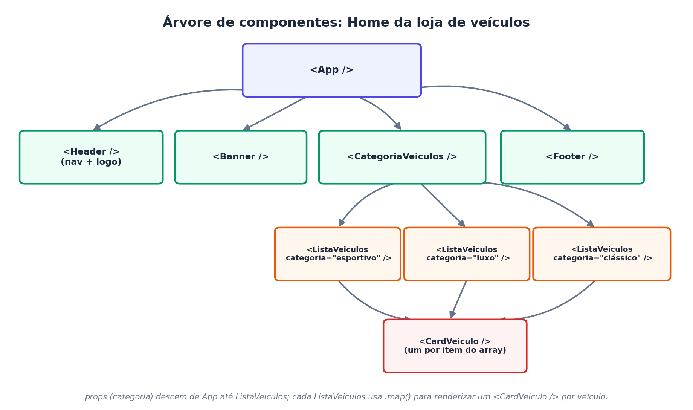

# Elementos Básicos de HTML em React {#elementos-html-react}

**Disciplina:** Programação Web Full Stack — Engenharia de Software
**Tema da aula:** Construindo a interface com HTML "dentro" do React: elementos, componentes, CSS/Bootstrap e renderização dinâmica
**Pré-requisito:** Capítulo \@ref(introducao-react) — Introdução ao React (JSX, componentes, props, state, Vite)

**Referências desta aula:**

- Documentação oficial — [react.dev/learn](https://react.dev/learn)
- W3Schools React Tutorial — [React ES6](https://www.w3schools.com/react/react_es6.asp), [React CSS Styling](https://www.w3schools.com/react/react_css_styling.asp)
- Material de apoio da disciplina: `04-introdução-ao-react.pptx`

---

## Objetivos da aula

Ao final desta aula, o(a) aluno(a) deve ser capaz de:

1. Criar, em componentes React, os elementos básicos de HTML (listas, tabelas, imagens, seções, links, menus de navegação, `div`, `header`, `footer`, entre outros).
2. Organizar esses elementos em componentes reutilizáveis, e não em um único arquivo monolítico.
3. Aplicar CSS a componentes React, incluindo o uso do Bootstrap.
4. Usar **expressões** dentro do JSX e aplicar **renderização condicional**.
5. Construir, passo a passo, a home page de uma loja de veículos com três categorias de produtos (esportivos, luxo e clássicos).

---

## De HTML "puro" para elementos em componentes React {#html-para-componentes}

Até aqui, os componentes que construímos retornavam pouco JSX (um título, um parágrafo, um contador). Nesta aula, o objetivo é aprender a escrever, dentro de componentes React, os mesmos elementos que vocês já usam em HTML — só que agora cada pedaço da página pode virar um **componente independente**, reutilizável e testável separadamente.

A regra geral do "passo a passo" que seguiremos para qualquer elemento novo é sempre a mesma:

1. **Pensar no HTML puro** que você escreveria para aquele pedaço da página.
2. **Criar um arquivo de componente** para ele dentro de `src/components/` (ex.: `src/components/Header.jsx`).
3. **Colar a estrutura HTML dentro do `return`** do componente, convertendo os atributos que o JSX exige (`class` → `className`, `for` → `htmlFor`, etc. — ver Tabela \@ref(tab:tabela-atributos-jsx)).
4. **Importar e usar o componente** dentro de outro componente (geralmente `App.jsx`), com a tag `<NomeDoComponente />`.
5. **Testar no navegador**, com `npm run dev` rodando (ver Seção \@ref(o-que-e-vite) do Capítulo \@ref(introducao-react)).

Table: (\#tab:tabela-atributos-jsx) Atributos HTML que mudam de nome no JSX

| HTML | JSX (React) | Motivo |
|---|---|---|
| `class="..."` | `className="..."` | `class` é palavra reservada em JavaScript. |
| `for="..."` (em `<label>`) | `htmlFor="..."` | `for` também é palavra reservada em JavaScript (usada em laços). |
| `onclick="..."` | `onClick={...}` | Eventos em React usam camelCase e recebem uma função JS, não uma string. |
| `style="color:red"` | `style={{ color: 'red' }}` | O `style` recebe um **objeto** JavaScript, não uma string CSS. |
| `tabindex` | `tabIndex` | Atributos compostos seguem o padrão camelCase do JavaScript. |

---

## Estrutura geral de uma página com componentes

Antes dos exemplos individuais, vale visualizar como os elementos de uma página comum (cabeçalho, menu, seções, rodapé) se transformam em uma **árvore de componentes**. Cada `<div>`, `<header>`, `<nav>` etc. deixa de ser só uma tag HTML e passa a ser (ou fazer parte de) um componente:

```jsx
// src/App.jsx
import Header from './components/Header';
import Banner from './components/Banner';
import Footer from './components/Footer';
import './App.css';

function App() {
  return (
    <div className="App">
      <Header />
      <Banner />
      {/* outras seções da página entram aqui */}
      <Footer />
    </div>
  );
}

export default App;
```

Repare que `App.jsx` praticamente não tem HTML "cru" — ele apenas **organiza** outros componentes. Essa é a prática recomendada: cada componente cuida de uma parte pequena e coesa da interface.

---

## Criando elementos básicos de HTML como componentes

Nesta seção, cada subtópico segue o passo a passo da Seção \@ref(html-para-componentes): pense no HTML, crie o componente, use-o em `App.jsx`, teste no navegador.

### `div`, `section`, `header` e `footer`

Esses quatro elementos são os "blocos de construção" de qualquer página e, no React, viram componentes de estrutura/layout:

```jsx
// src/components/Header.jsx
function Header() {
  return (
    <header className="site-header">
      <div className="logo">🚗 AutoStore</div>
    </header>
  );
}

export default Header;
```

```jsx
// src/components/Footer.jsx
function Footer() {
  return (
    <footer className="site-footer">
      <p>&copy; 2026 AutoStore — Todos os direitos reservados.</p>
    </footer>
  );
}

export default Footer;
```

```jsx
// src/components/Sobre.jsx
function Sobre() {
  return (
    <section className="sobre">
      <div className="sobre-texto">
        <h2>Sobre a AutoStore</h2>
        <p>Vendemos veículos esportivos, de luxo e clássicos há mais de 20 anos.</p>
      </div>
    </section>
  );
}

export default Sobre;
```

**Onde testar:** importe cada componente em `src/App.jsx` (como no exemplo da seção anterior) e salve — com o `npm run dev` rodando, o navegador atualiza sozinho.

### Listas numeradas e não numeradas

Listas não numeradas usam `<ul>`/`<li>`; listas numeradas usam `<ol>`/`<li>`. A prática mais comum em React é gerar os itens **dinamicamente**, a partir de um array, usando o método `.map()` — isso evita repetir `<li>` manualmente para cada item.

```jsx
// src/components/Diferenciais.jsx
function Diferenciais() {
  const itens = [
    'Veículos revisados e com garantia',
    'Financiamento facilitado',
    'Avaliação do seu usado na troca',
  ];

  return (
    <ul className="lista-diferenciais">
      {itens.map((item, index) => (
        <li key={index}>{item}</li>
      ))}
    </ul>
  );
}

export default Diferenciais;
```

```jsx
// Exemplo com lista numerada (<ol>)
function ComoComprar() {
  const passos = ['Escolha o veículo', 'Agende um test-drive', 'Feche negócio'];

  return (
    <ol className="lista-passos">
      {passos.map((passo, index) => (
        <li key={index}>{passo}</li>
      ))}
    </ol>
  );
}

export default ComoComprar;
```

> **Atenção ao `key`:** sempre que renderizamos uma lista com `.map()`, o React exige uma prop `key` única em cada item, para saber identificar o que mudou entre uma renderização e outra. Usar o índice do array (`index`) é aceitável para listas simples e estáticas; em listas que podem ser reordenadas ou filtradas, o ideal é usar um identificador único do próprio dado (por exemplo, um `id`).

### Tabelas

Tabelas HTML (`<table>`, `<thead>`, `<tbody>`, `<tr>`, `<td>`) funcionam da mesma forma dentro do JSX, também combinadas com `.map()` quando os dados vêm de um array:

```jsx
// src/components/TabelaVeiculos.jsx
function TabelaVeiculos() {
  const veiculos = [
    { modelo: 'Civic Si', categoria: 'Esportivo', preco: 'R$ 189.000' },
    { modelo: 'BMW Série 7', categoria: 'Luxo', preco: 'R$ 620.000' },
    { modelo: 'Fusca 1972', categoria: 'Clássico', preco: 'R$ 75.000' },
  ];

  return (
    <table className="tabela-veiculos">
      <thead>
        <tr>
          <th>Modelo</th>
          <th>Categoria</th>
          <th>Preço</th>
        </tr>
      </thead>
      <tbody>
        {veiculos.map((v) => (
          <tr key={v.modelo}>
            <td>{v.modelo}</td>
            <td>{v.categoria}</td>
            <td>{v.preco}</td>
          </tr>
        ))}
      </tbody>
    </table>
  );
}

export default TabelaVeiculos;
```

### Imagens

O atributo é `src`, igual ao HTML. Existem duas formas comuns de referenciar uma imagem em um projeto Vite:

```jsx
// 1. Imagem local, importada como módulo (recomendado: o Vite otimiza o arquivo)
import carroEsportivo from '../assets/carro-esportivo.jpg';

function ImagemDestaque() {
  return ;
}

export default ImagemDestaque;
```

```jsx
// 2. Imagem externa (URL), ou arquivo colocado na pasta public/
function ImagemExterna() {
  return ;
}
```

> **Local vs. `public/`:** imagens **importadas** (opção 1) ficam em `src/assets/`, passam pelo processo de build do Vite e têm o caminho final calculado automaticamente. Imagens colocadas em `public/` são copiadas exatamente como estão e referenciadas por caminho absoluto (ex.: `/carro.jpg`) — use `public/` para arquivos que não devem ser processados, como o favicon.

### Links

Enquanto a disciplina ainda não trabalha com bibliotecas de rotas (como o React Router, visto em aulas futuras), links para páginas externas ou âncoras internas usam a tag `<a>` normalmente:

```jsx
function LinkContato() {
  return (
    <a href="https://wa.me/5511999999999" target="_blank" rel="noopener noreferrer">
      Fale conosco no WhatsApp
    </a>
  );
}
```

- `target="_blank"` abre o link em uma nova aba.
- `rel="noopener noreferrer"` é uma boa prática de segurança sempre que se usa `target="_blank"`, evitando que a nova página tenha acesso à página de origem.

### Guia de navegação (menu / `nav`)

Um menu de navegação nada mais é do que uma lista (`<ul>`/`<li>`) de links (`<a>`), dentro de uma tag `<nav>`, tipicamente dentro do `<Header />`:

```jsx
// src/components/NavBar.jsx
function NavBar() {
  const categorias = [
    { nome: 'Esportivos', href: '#esportivos' },
    { nome: 'Luxo', href: '#luxo' },
    { nome: 'Clássicos', href: '#classicos' },
  ];

  return (
    <nav className="navbar">
      <ul>
        {categorias.map((cat) => (
          <li key={cat.href}>
            <a href={cat.href}>{cat.nome}</a>
          </li>
        ))}
      </ul>
    </nav>
  );
}

export default NavBar;
```

Esse `<NavBar />` pode então ser usado **dentro** do `<Header />`, mostrando como componentes se combinam:

```jsx
// src/components/Header.jsx (versão com menu)
import NavBar from './NavBar';

function Header() {
  return (
    <header className="site-header">
      <div className="logo">🚗 AutoStore</div>
      <NavBar />
    </header>
  );
}

export default Header;
```

---

## Incluindo CSS nos componentes

Existem três formas comuns de estilizar componentes React, da mais simples à mais robusta:

### 1. CSS por arquivo, importado no componente

Cada componente pode ter seu próprio arquivo `.css`, importado diretamente:

```jsx
// src/components/Header.jsx
import './Header.css';

function Header() {
  return <header className="site-header">...</header>;
}
```

```css
/* src/components/Header.css */
.site-header {
  display: flex;
  justify-content: space-between;
  padding: 1rem 2rem;
  background-color: #1e293b;
  color: white;
}
```

### 2. Estilo inline (via objeto JavaScript)

Útil para estilos calculados dinamicamente, mas evitado para estilos fixos (prefira CSS separado nesse caso):

```jsx
function Destaque() {
  const estilo = { color: 'crimson', fontWeight: 'bold' };
  return <p style={estilo}>Oferta especial esta semana!</p>;
}
```

### 3. Bootstrap

O **Bootstrap** é um framework CSS com classes prontas (`container`, `row`, `col`, `btn`, `card`, `navbar`, etc.) que aceleram a estilização sem escrever CSS do zero. Há duas formas de incluí-lo em um projeto Vite + React:

**Opção A — via CDN, direto no `index.html`** (mais simples para começar):

```html
<!-- index.html -->
<head>
  ...
  <link
    href="https://cdn.jsdelivr.net/npm/bootstrap@5.3.3/dist/css/bootstrap.min.css"
    rel="stylesheet"
  />
</head>
```

**Opção B — instalando via npm** (recomendada em projetos reais, pois fica registrada no `package.json`):

```bash
npm install bootstrap
```

```jsx
// src/main.jsx
import 'bootstrap/dist/css/bootstrap.min.css';
```

Depois de incluído por qualquer uma das opções, as classes do Bootstrap podem ser usadas normalmente via `className`:

```jsx
function Banner() {
  return (
    <div className="container text-center py-5 bg-light">
      <h1 className="display-4">Encontre o carro dos seus sonhos</h1>
      <button className="btn btn-primary btn-lg">Ver ofertas</button>
    </div>
  );
}
```

> **Para saber:** o Bootstrap não é obrigatório — dá para estilizar só com CSS próprio. Ele é útil quando o objetivo é ganhar tempo com um layout responsivo já pronto (grid de colunas, botões, cards), o que é bastante conveniente para os exercícios e para o projeto da disciplina.

---

## Expressões no JSX

Como já vimos no Capítulo \@ref(introducao-react), qualquer código entre chaves `{ }` dentro do JSX é uma **expressão JavaScript** avaliada e inserida no lugar. As formas mais comuns de uso são:

```jsx
function ExemploExpressoes() {
  const nome = 'Juliana';
  const precoBase = 150000;
  const desconto = 0.1;

  return (
    <div>
      {/* 1. Exibir uma variável */}
      <p>Olá, {nome}!</p>

      {/* 2. Fazer um cálculo */}
      <p>Preço com desconto: R$ {precoBase * (1 - desconto)}</p>

      {/* 3. Chamar uma função */}
      <p>Hoje é {new Date().toLocaleDateString('pt-BR')}</p>

      {/* 4. Alterar um estilo diretamente */}
      <p style={{ color: desconto > 0 ? 'green' : 'black' }}>
        {desconto > 0 ? 'Promoção ativa!' : 'Preço normal'}
      </p>
    </div>
  );
}
```

Em resumo, uma expressão entre `{ }` pode:

- Ler o valor de uma variável ou de uma prop.
- Realizar operações matemáticas ou concatenações.
- Chamar uma função JavaScript que retorna um valor (inclusive outro JSX).
- Retornar um componente React ou um array (vetor) de componentes React (é assim que o `.map()` funciona dentro do JSX).

O que **não** é permitido dentro de `{ }` são comandos (*statements*), como `if`, `for` ou `switch` — apenas expressões que produzem um valor. É exatamente por isso que a renderização condicional (próxima seção) usa operadores como o ternário, e não um `if` tradicional dentro do JSX.

---

## Renderização condicional

Renderização condicional é a técnica de mostrar (ou não) um trecho de JSX dependendo de uma condição — por exemplo, mostrar "Em promoção" apenas se o veículo tiver desconto.

### Operador ternário (`condição ? seA : seB`)

Ideal quando existem **duas** alternativas possíveis:

```jsx
function Estoque({ quantidade }) {
  return (
    <p>{quantidade > 0 ? 'Disponível em estoque' : 'Sob encomenda'}</p>
  );
}
```

### Operador `&&` (renderiza só se a condição for verdadeira)

Ideal quando existe apenas **uma** alternativa — o elemento aparece ou simplesmente não aparece:

```jsx
function SeloPromocao({ emPromocao }) {
  return (
    <div className="card">
      <h3>Civic Si</h3>
      {emPromocao && <span className="selo">Promoção!</span>}
    </div>
  );
}
```

> **Cuidado:** se a variável testada com `&&` puder ser `0` (número zero), o React vai renderizar o próprio `0` na tela, em vez de "nada" — por isso, com números, prefira transformar a condição em booleana (`quantidade > 0 && ...`) em vez de usar a variável numérica diretamente (`quantidade && ...`).

### `if` / `else` fora do JSX

Para lógicas mais complexas, o mais legível é decidir **antes** do `return`, guardando o resultado em uma variável (ou usando um retorno antecipado):

```jsx
function StatusVeiculo({ categoria }) {
  let rotulo;

  if (categoria === 'esportivo') {
    rotulo = '🏁 Esportivo';
  } else if (categoria === 'luxo') {
    rotulo = '💎 Luxo';
  } else {
    rotulo = '🚗 Clássico';
  }

  return <span className="rotulo">{rotulo}</span>;
}
```

```jsx
// Retorno antecipado: útil para "não renderizar nada" em certos casos
function AlertaEstoqueBaixo({ quantidade }) {
  if (quantidade > 3) {
    return null; // React não renderiza nada
  }

  return <p className="alerta">Últimas unidades!</p>;
}
```

---

## Exemplo de aula: Home page da loja de veículos AutoStore

Vamos aplicar tudo o que foi visto — elementos HTML em componentes, listas, tabelas, CSS/Bootstrap, expressões e renderização condicional — para construir, passo a passo, a **home page** de uma loja fictícia de veículos, a **AutoStore**, com três categorias: **esportivos**, **luxo** e **clássicos**.

> Esta página usará, por enquanto, um **array de dados fixo** (*mock data*) dentro do próprio código. Em uma aula futura, esses dados passarão a vir de uma API REST (temos como referência a API construída no livro *Node.js Essencial*, de Ricardo R. Lecheta), substituindo o array fixo por dados buscados do servidor.

A Figura \@ref(fig:figura-loja-veiculos-arvore) mostra a árvore de componentes que vamos construir.

(#fig:figura-loja-veiculos-arvore)


### Passo 1 — Criar o projeto

```bash
npm create vite@latest autostore -- --template react
cd autostore
npm install
npm install bootstrap
npm run dev
```

### Passo 2 — Incluir o Bootstrap

```jsx
// src/main.jsx
import { StrictMode } from 'react';
import { createRoot } from 'react-dom/client';
import App from './App.jsx';
import 'bootstrap/dist/css/bootstrap.min.css';
import './index.css';

createRoot(document.getElementById('root')).render(
  <StrictMode>
    <App />
  </StrictMode>,
);
```

### Passo 3 — Criar os dados dos veículos (mock)

```jsx
// src/data/veiculos.js
const veiculos = [
  { id: 1, modelo: 'Civic Si', categoria: 'esportivo', preco: 189000, promocao: true },
  { id: 2, modelo: 'Mustang GT', categoria: 'esportivo', preco: 320000, promocao: false },
  { id: 3, modelo: 'BMW Série 7', categoria: 'luxo', preco: 620000, promocao: false },
  { id: 4, modelo: 'Mercedes Classe S', categoria: 'luxo', preco: 750000, promocao: true },
  { id: 5, modelo: 'Fusca 1972', categoria: 'classico', preco: 75000, promocao: false },
  { id: 6, modelo: 'Opala 1978', categoria: 'classico', preco: 98000, promocao: true },
];

export default veiculos;
```

### Passo 4 — Componente `Header` com `NavBar`

```jsx
// src/components/Header.jsx
function Header() {
  return (
    <header className="navbar navbar-dark bg-dark px-4">
      <span className="navbar-brand mb-0 h1">🚗 AutoStore</span>
      <nav>
        <ul className="nav">
          <li className="nav-item">
            <a className="nav-link text-white" href="#esportivo">Esportivos</a>
          </li>
          <li className="nav-item">
            <a className="nav-link text-white" href="#luxo">Luxo</a>
          </li>
          <li className="nav-item">
            <a className="nav-link text-white" href="#classico">Clássicos</a>
          </li>
        </ul>
      </nav>
    </header>
  );
}

export default Header;
```

### Passo 5 — Componente `Banner`

```jsx
// src/components/Banner.jsx
function Banner() {
  return (
    <div className="container-fluid text-center py-5 bg-light">
      <h1 className="display-5">Encontre o carro dos seus sonhos</h1>
      <p className="lead">Esportivos, luxo e clássicos, tudo em um só lugar.</p>
    </div>
  );
}

export default Banner;
```

### Passo 6 — Componente `CardVeiculo` (com renderização condicional)

```jsx
// src/components/CardVeiculo.jsx
function CardVeiculo({ veiculo }) {
  return (
    <div className="card m-2" style={{ width: '18rem' }}>
      <div className="card-body">
        <h5 className="card-title">
          {veiculo.modelo}{' '}
          {veiculo.promocao && <span className="badge bg-danger">Promoção</span>}
        </h5>
        <p className="card-text">
          R$ {veiculo.promocao ? (veiculo.preco * 0.9).toLocaleString('pt-BR') : veiculo.preco.toLocaleString('pt-BR')}
        </p>
      </div>
    </div>
  );
}

export default CardVeiculo;
```

Note o uso combinado de **expressão** (`veiculo.modelo`), **renderização condicional com `&&`** (o selo de promoção) e **ternário** (cálculo do preço com ou sem desconto).

### Passo 7 — Componente `ListaVeiculos` (recebe a categoria via props)

```jsx
// src/components/ListaVeiculos.jsx
import CardVeiculo from './CardVeiculo';
import veiculos from '../data/veiculos';

function ListaVeiculos({ categoria, titulo }) {
  const filtrados = veiculos.filter((v) => v.categoria === categoria);

  return (
    <section id={categoria} className="mb-4">
      <h2 className="px-4 pt-3">{titulo}</h2>
      <div className="d-flex flex-wrap px-4">
        {filtrados.map((v) => (
          <CardVeiculo key={v.id} veiculo={v} />
        ))}
      </div>
    </section>
  );
}

export default ListaVeiculos;
```

### Passo 8 — Componente `CategoriaVeiculos` (agrupa as três listas)

```jsx
// src/components/CategoriaVeiculos.jsx
import ListaVeiculos from './ListaVeiculos';

function CategoriaVeiculos() {
  return (
    <div>
      <ListaVeiculos categoria="esportivo" titulo="🏁 Esportivos" />
      <ListaVeiculos categoria="luxo" titulo="💎 Luxo" />
      <ListaVeiculos categoria="classico" titulo="🚗 Clássicos" />
    </div>
  );
}

export default CategoriaVeiculos;
```

### Passo 9 — Componente `Footer`

```jsx
// src/components/Footer.jsx
function Footer() {
  return (
    <footer className="bg-dark text-white text-center py-3">
      <p className="mb-0">&copy; 2026 AutoStore — Todos os direitos reservados.</p>
    </footer>
  );
}

export default Footer;
```

### Passo 10 — Montando tudo em `App.jsx`

```jsx
// src/App.jsx
import Header from './components/Header';
import Banner from './components/Banner';
import CategoriaVeiculos from './components/CategoriaVeiculos';
import Footer from './components/Footer';

function App() {
  return (
    <div className="App">
      <Header />
      <Banner />
      <CategoriaVeiculos />
      <Footer />
    </div>
  );
}

export default App;
```

### Passo 11 — Testar o resultado

1. Com `npm run dev` rodando, abra `http://localhost:5173` no navegador.
2. Confira se aparecem: o menu no topo, o banner, as três seções (Esportivos, Luxo, Clássicos) com os cards de veículo, e o rodapé.
3. Clique nos links do menu (`Esportivos`, `Luxo`, `Clássicos`) — como cada `<section>` tem um `id` igual à categoria, o navegador deve rolar até a seção correspondente (âncoras internas).
4. Confirme que os veículos marcados com `promocao: true` em `src/data/veiculos.js` aparecem com o selo **"Promoção"** e com o preço já calculado com desconto — essa é a renderização condicional funcionando.
5. Altere um valor em `src/data/veiculos.js` (por exemplo, mude `promocao` de um item para `true`) e salve: o navegador deve atualizar sozinho, sem recarregar a página (Hot Module Replacement).

---

## Atividade prática

1. Seguir os 11 passos desta seção e construir a home page da AutoStore no próprio computador.
2. Adicionar um novo componente `TabelaComparativa`, usando `<table>`, que compare os veículos de uma categoria à sua escolha (modelo, preço, ano — adicione o campo `ano` ao array de dados).
3. Adicionar um link de **"Fale conosco"** no `Footer`, apontando para um número de WhatsApp fictício, abrindo em uma nova aba.
4. Usar a renderização condicional para exibir a mensagem **"Nenhum veículo encontrado"** caso uma categoria não tenha nenhum item (dica: verifique o tamanho do array `filtrados` dentro de `ListaVeiculos`).
5. **Desafio extra:** trocar as classes de CSS "cruas" (caso tenham sido usadas) pelas classes equivalentes do Bootstrap (`card`, `badge`, `d-flex`, etc.), comparando o antes e o depois.

---

## Resumo dos conceitos-chave

Table: (\#tab:tabela-resumo-elementos-html) Resumo dos conceitos-chave apresentados na aula

| Conceito | Definição resumida |
|---|---|
| **Componente de layout** | Componente que organiza a estrutura da página (`Header`, `Footer`, `section`), geralmente sem lógica complexa. |
| **`className` / `htmlFor`** | Versões em JSX dos atributos HTML `class` e `for`, que são palavras reservadas em JavaScript. |
| **`.map()` em listas/tabelas** | Técnica padrão para gerar `<li>`, `<tr>` ou `<Componente />` dinamicamente a partir de um array, sempre com uma prop `key` única. |
| **CSS por componente** | Cada componente pode importar seu próprio arquivo `.css`, mantendo os estilos organizados e isolados. |
| **Bootstrap** | Framework CSS com classes prontas, incluído via CDN (`index.html`) ou via `npm install bootstrap` + import em `main.jsx`. |
| **Expressão no JSX** | Qualquer código entre `{ }` que produz um valor: variáveis, cálculos, chamadas de função, arrays de componentes. |
| **Renderização condicional** | Exibir ou ocultar JSX com base em uma condição, usando ternário (`? :`), `&&`, ou lógica antes do `return`. |

---

## Para saber mais (leitura complementar)

- Documentação oficial: [react.dev/learn/conditional-rendering](https://react.dev/learn/conditional-rendering) e [react.dev/learn/rendering-lists](https://react.dev/learn/rendering-lists)
- Documentação do Bootstrap: [getbootstrap.com](https://getbootstrap.com)
- Lecheta, Ricardo R. *Node.js Essencial* — referência para a futura substituição dos dados fixos (mock) por uma API REST consumida pelos componentes `ListaVeiculos`/`CardVeiculo`.
- Próximos tópicos recomendados para a disciplina: eventos (`onClick`, formulários controlados), `useEffect` para buscar dados de uma API, e consumo da API do livro *Node.js Essencial* nesta mesma página da AutoStore.